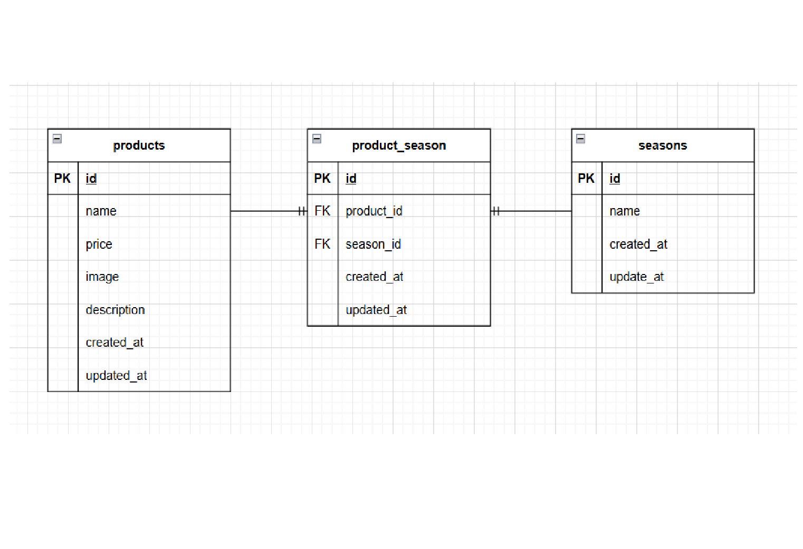

# mogitate(Product List Application)
Laravel + Docker 環境で構築された商品管理アプリケーションです。

---

## 環境構築手順

### 1. リポジトリをクローン
git clone git@github.com:ToshiyaTaguchi/product-list.git
cd product-list

**Dockerの起動**
1.  Docker Desktop を起動後、以下を実行
2. `docker-compose up -d --build`

> *MacのM1・M2チップのPCの場合、`no matching manifest for linux/arm64/v8 in the manifest list entries`のメッセージが表示されビルドができないことがあります。
エラーが発生する場合は、docker-compose.ymlファイルの「mysql」内に「platform」の項目を追加で記載してください*
``` bash
mysql:
    platform: linux/x86_64(この文追加)
    image: mysql:8.0.26
    environment:
```

**Laravel環境構築**
1. コンテナに入る
     `docker-compose exec php bash`
2. composer install を実行
``` bash
composer install
```
3. .envファイルの作成
``` bash
     `cp .env.example .env`
```
4. .envに以下の環境変数を追加
``` text
DB_CONNECTION=mysql
DB_HOST=mysql
DB_PORT=3306
DB_DATABASE=laravel_db
DB_USERNAME=laravel_user
DB_PASSWORD=laravel_pass
```
5. アプリケーションキーの作成
``` bash
php artisan key:generate
```

6. マイグレーションの実行
``` bash
php artisan migrate
```

7. シーディングの実行
``` bash
php artisan db:seed
```
8. シンボリックリンクの作成(画像表示用)
``` bash
php artisan storage:link
```
## 使用技術(実行環境)
- PHP8.4.2
- Laravel8.83.29
- MySQL8.0.42
- Docker, Composer, phpMyAdmin

## ER図


## URL
- 開発環境：http://localhost/
- phpMyAdmin:：http://localhost:8080/
